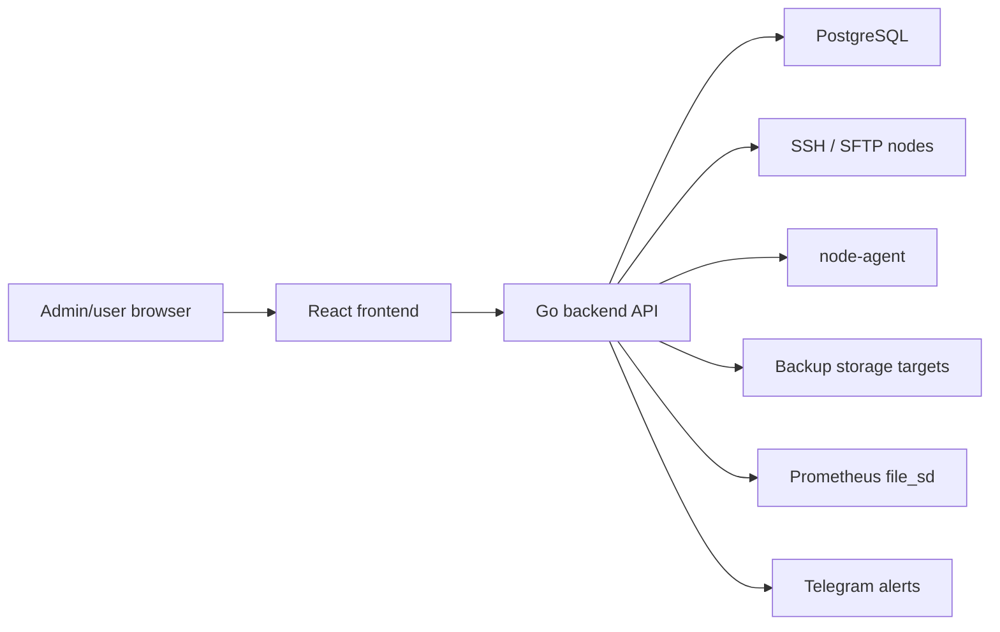

# Architecture

This repository contains a server monitoring/panel aggregator with a Go backend, React frontend, PostgreSQL storage, optional node-agent and Prometheus integration.

A formal independent third-party security audit has not yet been completed.

## Main Components

- `backend/`: Go API built with Gin, GORM and PostgreSQL.
- `frontend/`: Vite + React UI.
- `backend/migrations/`: database migrations.
- `deploy/prometheus/`: Prometheus configuration and target discovery.
- `docs/backup-center.md`: Backup Center documentation.
- `docker-compose.yml`: local/deployment stack for PostgreSQL, migrations, backend, frontend and Prometheus.

## Data Flow

## Security Boundaries

- Browser/API boundary with JWT/session authentication.
- Backend/database boundary containing credentials and operational metadata.
- SSH/node-agent boundary for remote host operations.
- Backup storage boundary containing external provider credentials.
- Prometheus and Telegram integration boundaries.

## Build and Runtime

The stack can run with Docker Compose. The backend requires `DB_DSN`, `AGG_MASTER_KEY_BASE64`, admin credentials and JWT/token settings. The master key is used for encrypted secrets at rest according to README/Backup Center documentation.

## Known Limitations

- Formal external audit is not completed yet.
- Some operations can run privileged SSH/sudo commands on remote hosts.
- Backup/file/database viewer features can expose sensitive remote data if authorization is weak.
- Retention and access review policies are deployment-specific.
